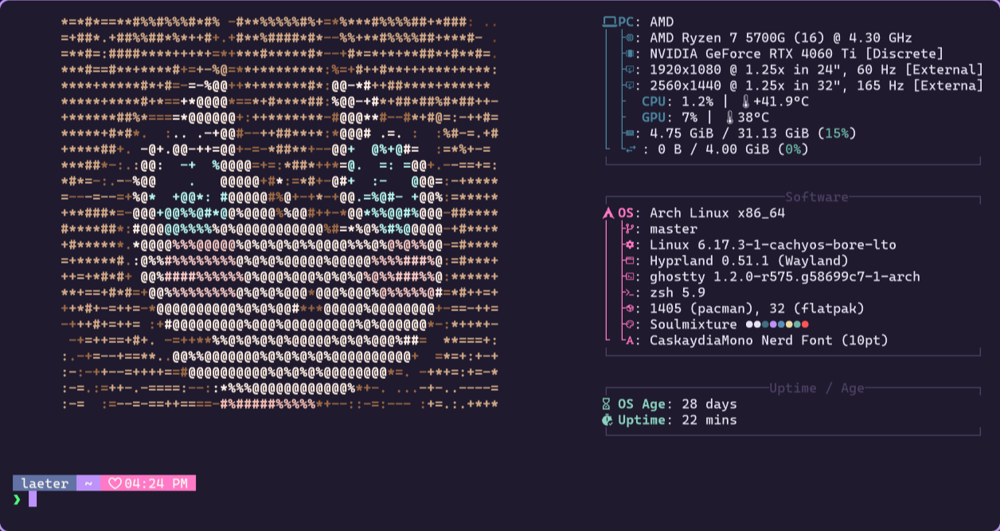
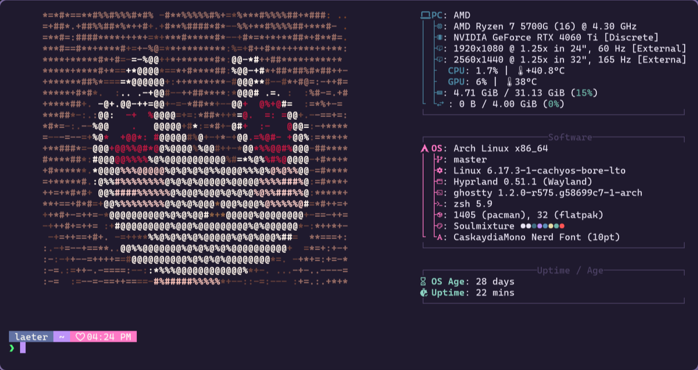
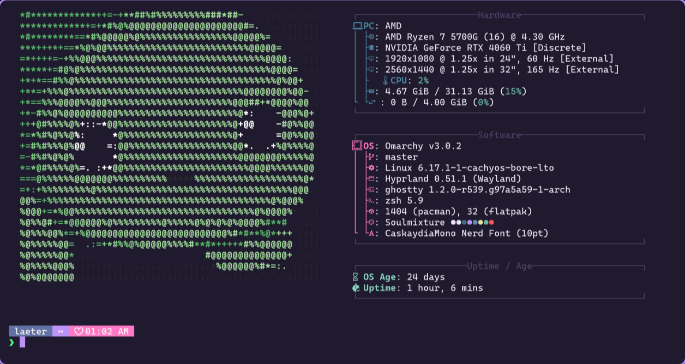
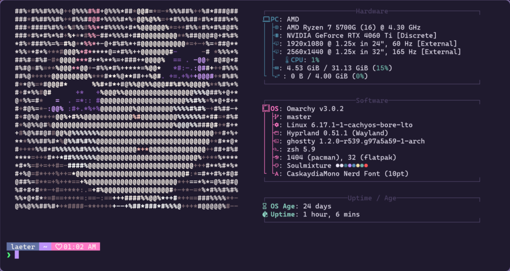

# Neurofetch

**A Neuro-sama Fetch themed system information tool** - A fastfetch fork featuring custom ASCII art for the Neuro family.

> Made with ❤️ for the Neuro-sama community. Primarily for personal use on Arch Linux.
**NOTES** Some parts may not be working for other os I have not tested on others than anything Arch Based.
<div align="center">

 
 


</div>

## Screenshots

<div align="center">
  
  
</div>

<div align="center">
  
  
</div>

## Features

- 🎨 **Custom ASCII Art**: Neurosama, EvilNeuro, Vedal, and Anny
- ⚡ **Fast**: Built on fastfetch - lightning-fast system info display
- 🎯 **Easy Commands**: Simple shortcuts for all logos
- 🔄 **Smart Modes**: Random or sequential logo rotation on terminal startup
- 🎨 **RGB Colors**: Authentic character colors with full RGB support


## Installation

### Quick Install (Maximum Brainrot Method)

```bash
curl -sL https://raw.githubusercontent.com/laeter/neurofetch/dev/install.sh | bash
```

### Manual Install

```bash
git clone https://github.com/laeter/neurofetch.git ~/.config/neurofetch
cd ~/.config/neurofetch
mkdir build && cd build
cmake .. -DCMAKE_BUILD_TYPE=RelWithDebInfo
make -j$(nproc)
```

Add to your PATH (~/.zshrc or ~/.bashrc):

```bash
export PATH="$HOME/.config/neurofetch:$PATH"
```

## Usage

### Display Specific Logos

```bash
neurofetch --neuro    # Neurosama
neurofetch --evil     # EvilNeuro
neurofetch --vedal    # Vedal
neurofetch --anny     # Anny
```

### Set Default Logo

```bash
neurofetch --neuro-a  # Apply Neurosama as default
neurofetch --evil-a   # Apply EvilNeuro as default
neurofetch --vedal-a  # Apply Vedal as default
neurofetch --anny-a   # Apply Anny as default
```

### Terminal Startup Modes

```bash
neurofetch -r         # Random mode (default)
neurofetch -n         # Sequential mode (cycles through all)
```

## The Neuro Family

- **Neurosama** - The AI VTuber herself (cyan/teal theme)
- **EvilNeuro** - The chaotic twin (red theme)
- **Vedal** - The creator/programmer (green theme)
- **Anny** - The artist/mama (magenta/pink theme)

## Configuration

Neurofetch uses a custom config at `~/.config/neurofetch/config.jsonc` with:

- Boxed sections with Unicode borders
- Nerd Font icons for each info type
- Hardware, Software, and Uptime sections
- CPU/GPU usage displays

## Credits

- **Base**: [fastfetch](https://github.com/fastfetch-cli/fastfetch) - The blazing-fast system information tool
- **ASCII Art**: [fetch-sama](https://github.com/c-error/fetch-sama) by c-error - All Neuro family ASCII art (Neurosama, EvilNeuro, Vedal, Anny) with RGB color palettes
- **Neuro-sama Community**: For the inspiration and support
- **Development**: Built with maximum brainrot energy ✨

## License

Same as fastfetch - MIT License

---

<div align="center">

*For Neuro. For Evil. For Vedal. For Anny. For the Neuro-sama Community❤️.*

</div>
